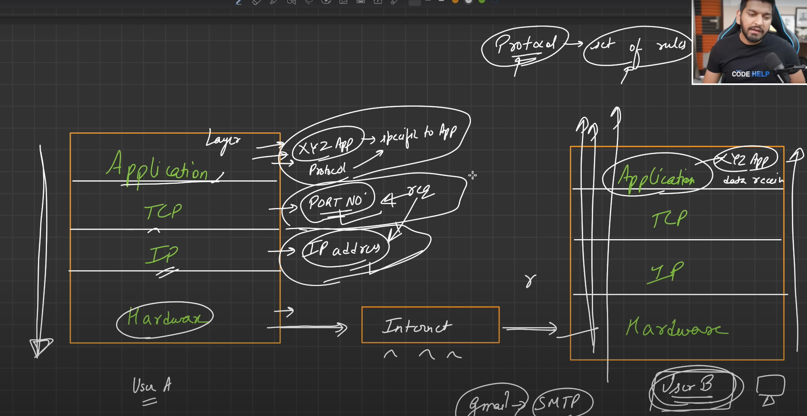

#Web Development Notes

##[Video source](https://www.youtube.com/watch?v=ofHYRdWQESo)

##History

## Protocol Stack & packets
1. 

2. 

##H/W
    1. Switch
    2. Hub
    3. Modem
        It is used in conversion of digital  to analog vice versa
    4. Router
    
    5. command to print server ip address of a url
        ping www.google.com
    6. Search DNS tree structure in google
    7. IPAddresses(v4, v6?)
        IPv4 and IPv6 are internet protocol versions. IPv4 is a 32-bit system using a string of numbers separated by periods, whereas IPv6 is a 128-bit system using alphanumeric sequences separated by colons. The main difference between IPv4 and IPv6 is their address format and available address space. IPv4 uses a 32-bit address format, allowing for approximately 4.3 billion unique addresses. On the other hand, IPv6 provides a large address space and contains a simple header as compared to IPv4.

        The need for IPv6 arose due to the exhaustion of the available address space in IPv4. The number of devices connected to the internet has increased exponentially over the years, and with the limited number of IP addresses available in IPv4, it was necessary to develop a new protocol that could accommodate more devices.
    8. OSI model (PDNTSPA) / TCP/IP model

TCP/IP Contain 4 Layers : 

Application layer, Transport layer, Internet layer, and Network Access layer. 
Each layer is responsible for specific functions, such as handling data transmission, addressing, error control, and flow control.

OSI Contain 7-layer model that was developed by the International Organization for Standardization (ISO) 

The seven layers of the OSI model are :-
Application layer, Presentation layer, Session layer, Transport layer, Network layer, Data Link layer, and Physical layer. 

Each layer provides specific functions, such as managing the connection, encryption, compression, routing, and framing of data.

The major differences between TCP/IP and OSI models are:
- TCP/IP is a simpler model and more commonly used, whereas OSI is a more complex model and less commonly used.
- TCP/IP combines the presentation and session layers of OSI into the application layer.
- TCP/IP does not include the physical and data link layers as separate layers, instead combining them into the Network Access layer.
- TCP/IP is more flexible than OSI, allowing for more variation in implementations.
- TCP/IP is used for communication between different networks and is used in applications such as web browsing, email, and file sharing, while OSI is primarily used in academic and research environments.

In summary, both TCP/IP and OSI models provide a framework for standardizing communication protocols in computer networking. TCP/IP is a simpler and more widely used model used for Internet communication, while OSI is a more complex and less commonly used model used more in academic and research environments.

##OSI MODEL :

The OSI model is like a big building with different floors. Each floor does a different job to help make sure messages can travel from one computer to another.

The first floor is called the Physical layer, and it's like the foundation of the building. It helps send messages through wires or airwaves.

The second floor is called the Data Link layer, and it's like the security guards of the building. They make sure messages are sent to the right place and that no one else can read them.

The third floor is called the Network layer, and it's like the map of the building. It helps messages find their way through different paths to get to their destination.

The fourth floor is called the Transport layer, and it's like the delivery people of the building. They make sure messages get to their destination on time and in the right order.

The fifth floor is called the Session layer, and it's like the helpers who make sure everyone is talking to each other nicely.

The sixth floor is called the Presentation layer, and it's like the decorators of the building. They make sure messages are in a format that can be understood by both computers.

The seventh floor is called the Application layer, and it's like the people who use the building. They send and receive messages for different purposes, like sending emails or watching videos.

So, just like a big building has different floors with different jobs, the OSI model has different layers that work together to help messages travel from one computer to another.

##How a packets travels over internet?

When a packet travels over the internet, it follows a series of steps to reach its destination. Let's outline the general process:

1. Packetization: The data to be transmitted is divided into smaller packets. Each packet typically includes a header that contains information such as the source and destination addresses, sequence numbers, error-checking codes, and other control information.

2. Routing: The packet is sent from the source device to the local network's router. The router examines the packet's destination address and determines the most efficient path for the packet to reach its destination. It checks its routing table, which contains information about network topology and available paths, and forwards the packet accordingly.

3. Network Hopping: As the packet traverses the network, it moves from one router to another, crossing different networks and potentially taking different paths. Each router examines the destination address of the packet and determines the next hop on the path towards the destination.

4. Internet Backbone: The packet may travel through various routers and network links, including high-capacity connections known as the internet backbone. These backbone connections interconnect different networks and facilitate the transmission of packets across vast distances.

5. Destination Network: The packet eventually reaches the destination network. The router within the destination network examines the destination address and forwards the packet to the appropriate destination device on the local network.

6. Packet Reassembly: Once all the packets arrive at the destination device, they are reassembled based on their sequence numbers and reconstructed to form the original data. This process ensures that the data is restored in the correct order.

It's important to note that the specific routing path and the number of hops a packet takes can vary dynamically based on network conditions, congestion, and the availability of different network links. Various routing protocols and algorithms help determine the most optimal path for each packet based on factors like speed, reliability, and congestion levels.

Additionally, protocols like TCP (Transmission Control Protocol) provide mechanisms for ensuring reliable delivery of packets by acknowledging their receipt and requesting retransmission if necessary. This helps to overcome packet loss or errors that may occur during transmission.

Overall, the journey of a packet involves traversing multiple routers, crossing various networks, and being forwarded based on destination addresses until it reaches its intended destination, where it is reassembled to retrieve the original data.