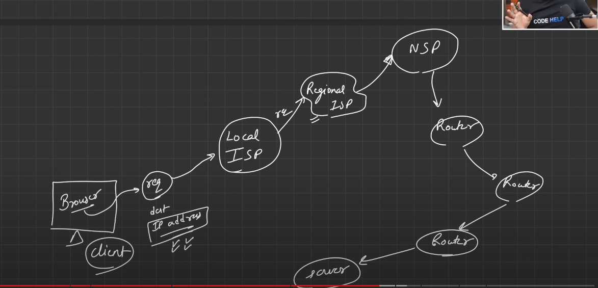

#Web Development Notes

##[Video source](https://www.youtube.com/watch?v=ofHYRdWQESo)

##History

## Protocol Stack & packets
    1. 
    2. 

##H/W
    1. Switch
    2. Hub
    3. Modem
    4. Router
    5. command to print server ip address of a url
    6. Search DNS tree structure in google
    7. IPAddresses(v4, v6?)
    8. OSI model (PDNTSPA) / TCP/IP model